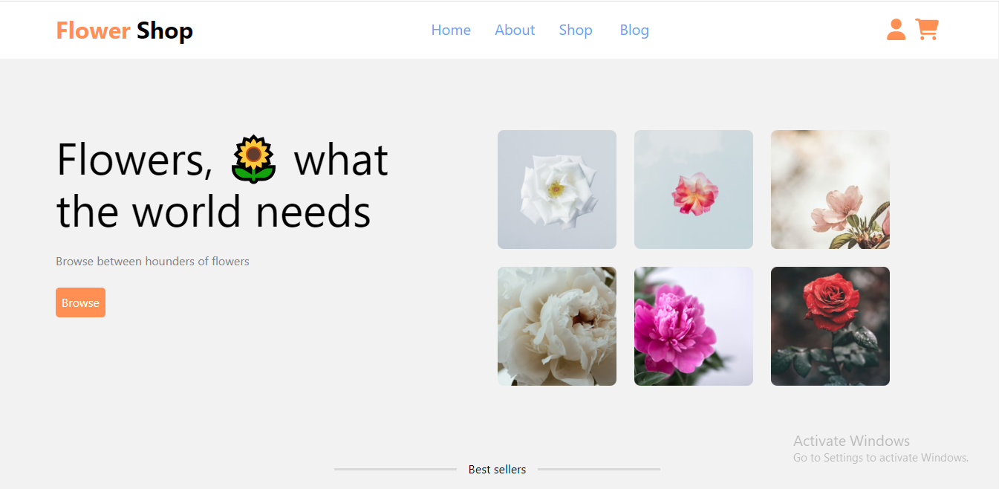
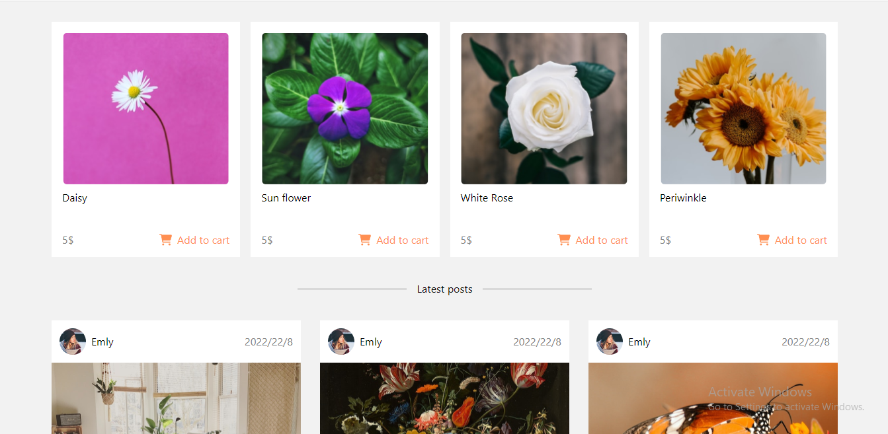
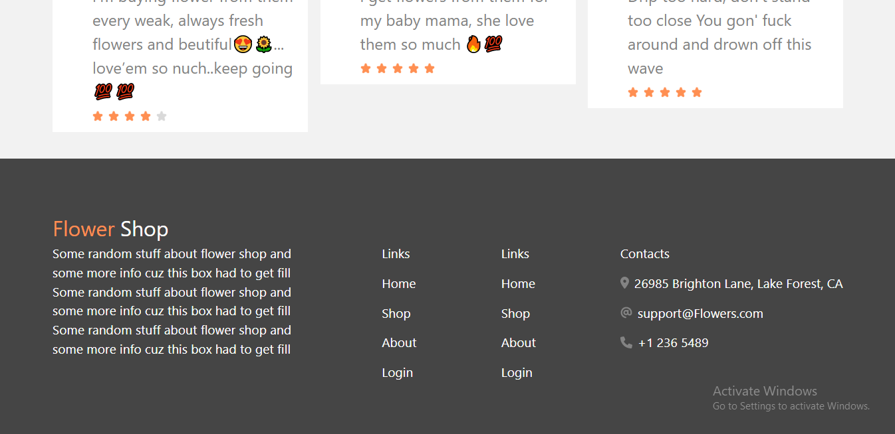

#  TailwindClass
*An implementation of TailwindClass clone with html, css and TailWind-css*
## Prequisite
- Your browser version should be up to date for better experience
## Features
- Home page
- About
## Tech/framework used
- Html
- Css
- TailWindCss
## Preview here
[Go Live](https://incandescent-gumdrop-caf2dc.netlify.app)

## Contact
If you want to contact me you can reach me at
- https://github.com/Intelligence247 or
- uthmanabdullahi2020@gmail.com
## Addtional Info
- This is one of the series of project for the @Code-Village.org
- This is not meant for production. It's for learning purpose only
